# 👋 Hello everyone! 

This is a little info about myself:

I am a Staff-level Engineer with an **18-year** evolution from medical-device firmware to leading large-scale AWS and Azure cloud migrations across FinTech, Retail, and Healthcare. I specialize in robust system design, building secure, compliant architectures rooted in industry best practices.

I also am deeply invested in mentoring high-performing teams, collaborating with stakeholders to turn complex requirements into business-aligned solutions, while embracing a lifelong learner mindset.

---

```python
me = SoftwareEngineer(
    name="Herberth Ureña Ballestero",
    experience_level="Senior",
    location="Costa Rica",
    focus="Cloud and AI-driven Solutions",

    interests= [
        "AI and Machine Learning",
        "Mentoring and Leadership",
        "System Design"
    ],

    people_skills= [
        "Business-driven problem solving",
        "Clear communication and documentation",
        "Cross-functional collaboration",
        "Technical guidance and mentorship"
    ]
)
```

## 🛠️ Skills

<table>
  <tr>
    <td valign="top" width="50%">
      <b>ARCHITECTURE AND SOFTWARE ENGINEERING</b>
      <ul>
        <li>API and systems design</li>
        <li>API governance and middleware contracts</li>
        <li>Distributed systems, event-driven architectures, and microservices</li>
        <li>Scalability, reliability, and observability</li>
      </ul>
    </td>
    <td valign="top" width="50%">
      <b>CLOUD AND DEVOPS</b>
      <ul>
        <li>Amazon Web Services (AWS), Azure</li>
        <li>Infrastructure-as-Code: CDK, CloudFormation</li>
        <li>CI/CD (GitHub Actions, Jenkins)</li>
        <li>Containerization and orchestration (Docker, ECS)</li>
        <li>Monitoring and observability (Azure Monitor, Application Insights, Datadog)</li>
      </ul>
    </td>
  </tr>
  <tr>
    <td valign="top" width="50%">
      <b>DELIVERY AND LEADERSHIP</b>
      <ul>
        <li>Agile delivery, SDLC ownership</li>
        <li>AI and automation: agentic workflows, AI-assisted engineering, and LLM orchestration</li>
        <li>Architectural decision records and documentation</li>
        <li>Cross-functional collaboration</li>
        <li>Technical leadership and mentorship</li>
      </ul>
    </td>
    <td valign="top" width="50%">
      <b>FRAMEWORKS AND LANGUAGES</b>
      <ul>
        <li>Angular, React</li>
        <li>ASP.NET, C#, .NET Core</li>
        <li>Boto3, Python</li>
        <li>gRPC, RESTful APIs</li>
        <li>Node.js, TypeScript</li>
      </ul>
    </td>
  </tr>
  <tr>
    <td valign="top" width="50%">
      <b>SECURITY AND COMPLIANCE</b>
      <ul>
        <li>Authentication and authorization (IAM, OAuth2, JWT)</li>
        <li>FDA/EU, HIPAA</li>
        <li>Secure system design</li>
      </ul>
    </td>
    <td valign="top" width="50%">
      <b>INTEGRATION AND DATA</b>
      <ul>
        <li>Publish-subscribe pattern (KafkaJS)</li>
        <li>CDC and ETL migrations, message-event brokers</li>
        <li>SQL / NoSQL (Document, Key-Value, Object Storage)</li>
      </ul>
    </td>
  </tr>
</table>

## 🏅 Latest Certifications

| Provider     | Badge                                                                 |
|--------------|------------------------------------------------------------------------|
| Microsoft    | [Azure Fundamentals (AZ-900)](https://learn.microsoft.com/api/credentials/share/en-us/HerberthFUB/201514B3A3650C8F?sharingId=E682FB489CAEB8CD) |
| AWS          | [AWS Certified Cloud Practitioner](https://www.credly.com/badges/cca9cb9e-b54b-4f8b-81ef-2ea4fce4f4cf) |

## 💻 GitHub Stats



